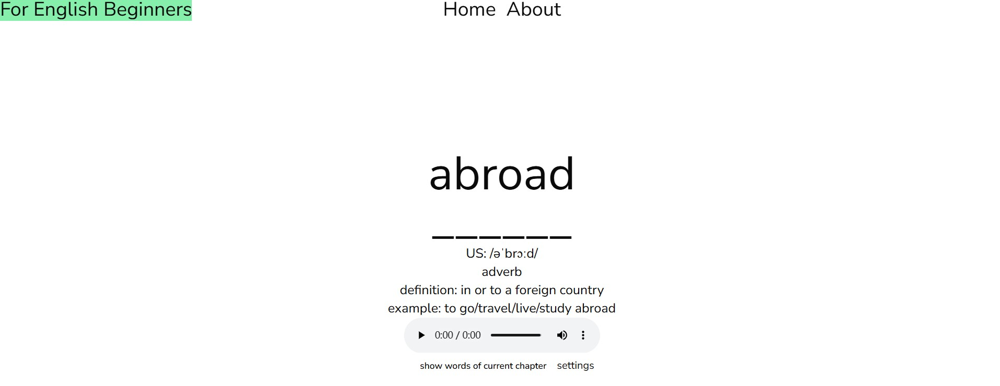

People can remember words on the site by using muscle memory formed by repeatedly typing English words on a keyboard.

Some people will type faster than English when typing in their native language, because many years of native language input has trained a very strong muscle memory, while English input muscle memory is relatively weak, prone to "pick up the pen and forget the word" phenomenon, through repeated practice on this website can solve this problem.

Nearly half of the words have no example sentences.

The Oxford 3000 is the list of the 3000 most important words to learn in EnglishThe Oxford 3000 is the list of the 3000 most important words to learn in English. this website use these words.

---

